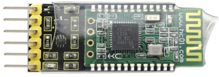
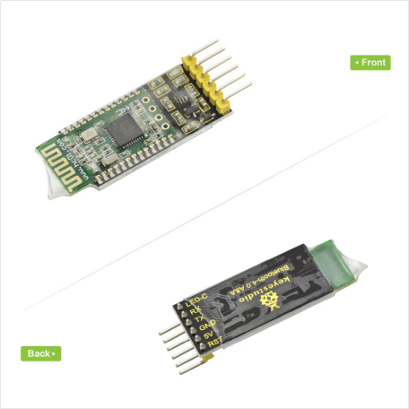
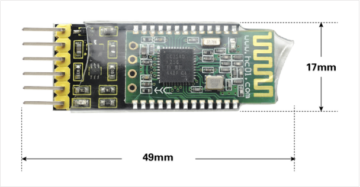
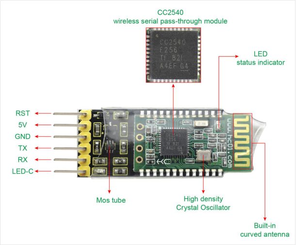
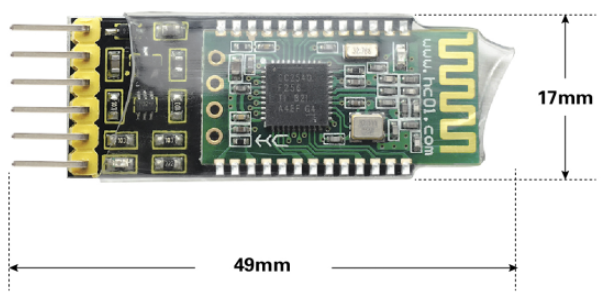
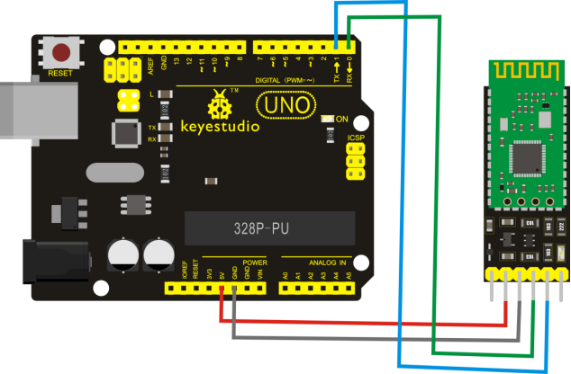
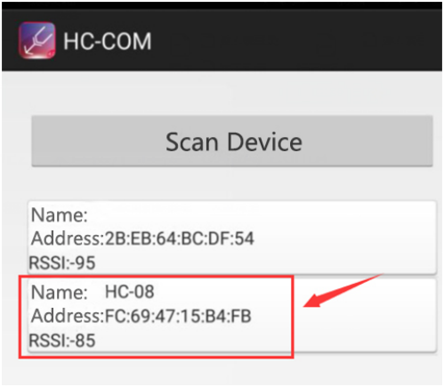
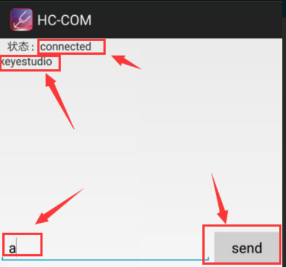

# KS0355 keyestudio HC-08 Bluetooth Module



## 1. Overview

Keyestudio HC-08 Bluetooth module is a new digital transmission module, based on the Bluetooth Specification V4.0 BLE Bluetooth protocol.

Its wireless working frequency band is 2.4GHz ISM, and the modulation method is GFSK.

The module's default transmit power is 4dBm. Receive sensitivity -93dBm.

The module is compatible with both Android and Apple systems. In an open environment, it can communicate with iphone4s, to achieve ultra-long-distance communication of 80 meters. It also comes with an LED status indicator. When using, you can directly see the connection state of Bluetooth.

The module uses the CC2540F256 chip from TI, configured with 256K bytes of space, supporting the AT command. For need, the users can change the role (master or slave mode), baud rate of serial port, device name and other parameters, very flexible use.



## 2. Detailed Interface





## 3. Technical Details

- Working voltage: DC 5V
- Working frequency band: 2.4G
- Air speed: 1Mbps
- Communication interface: UART3.3VTTL level
- Antenna interface: built-in PCB antenna
- Sleep current: 0.4μA
- RSSI support: not supported
- Receive sensitivity: -93dBm@1Mbps
- Communication level: 3.3V
- Bluetooth version: V4.0
- Modulation method: GFSK
- Transmit power: 4dBm (default)
- Reference distance: 80m
- Working temperature: -25℃ to +75℃
- Working humidity: 10% to 90%
- Storage temperature: -40℃ to +85℃
- Working current (excluding LED)
- Host not connected / connected: 21mA / 9mA
- Slave MODE0, not connected / connected: 8.5mA/9mA
- Slave MODE1, not connected / connected: 6μA ~ 2.6mA / 1.6mA
- Slave MODE2, not connected / connected: 0.4μA/1.6mA

**Extra:**

- Compatible with Android and Apple System
- Environmental-friendly

## 4. Dimensions

- Dimensions: 49mm * 17mm * 7mm



## 5. AT Command Settings

Before setting the AT command, for hardware, you need a USB to serial module (such as FT232 module) and several DuPont lines. For software, need a serial port assistant software, and install well the driver for the USB to serial module.

First, connect the Bluetooth module to FT232 module using DuPont line. The connection method is as follows.

| HC-08 Bluetooth Module | FT232 module |
| ---------------------- | ------------ |
| 5V                     | VCC（5V）    |
| GND                    | GND          |
| TX                     | RX           |
| RX                     | TX           |

Connected well, then connect the FT232 module (drive installation completed) to the computer using a USB cable.

First right-click the computer, for **properties** ->**Device Manager** to find the corresponding COM port. Then open the serial port assistant software, set the COM port, and the baud rate (initial default 9600).

After the connection is successful, you can start to set the AT command according to the instructions.

## 6. AT Command Instructions

**1.Testing Instruction**

| Command | Response | Instruction |
| ------- | -------- | ----------- |
| AT      | OK       | Test        |

**2.Check the basic parameters**

| Command | Response                                                     | Instruction                            |
| ------- | ------------------------------------------------------------ | -------------------------------------- |
| AT+RX   | Name:HC-08-- >>>> user-defined name for Bluetooth <br>Role:Slave-->>>> module’s role（master/slave)<br>Baud:9600,NONE-->>>> serial baud rate, check bit. <br>Addr:xx,xx,xx,xx,xx,xx-->>>> Bluetooth Address PIN :000000-->>>> Bluetooth password（invalid） | Inquire the basic parameters of module |

**3.Factory Data Reset Instruction**

| Command    | Response | Instruction                                                  |
| ---------- | -------- | ------------------------------------------------------------ |
| AT+DEFAULT | OK       | Factory Data Reset<br>**Note:** The slave address that the host has recorded will not be cleared! To clear, use the AT+CLEAR instruction to clear in the unconnected state. The module will restart automatically, and a new operation can be performed after restarting for 200ms! |

**4.Module Restart Instruction**

| Command  | Response | Instruction                                                  |
| -------- | -------- | ------------------------------------------------------------ |
| AT+RESET | OK       | restart the module<br>**Note:** The module will restart automatically, and a new operation can be performed after restarting for 200ms! |

**5.Check the software version**

| Command    | Response              | Instruction                                |
| ---------- | --------------------- | ------------------------------------------ |
| AT+VERSION | HC-08V3.1, 2017-07-07 | view the software version and release date |

**6.Modify the module’s role**

| Command   | Response     | Instruction                                                  |
| --------- | ------------ | ------------------------------------------------------------ |
| AT+ROLE=x | Master/Slave | Set the Master/ Slave<br>**Note:** By Slave default, the module will automatically restart after setting. A new operation can be performed after restarting for 200ms. |

Send: AT+ROLE=M Return: Master ( to restart)
Send: AT+ROLE=? Return: Master (without restart)

**7.Inquire and Modify the Bluetooth Name**

| Command     | Response  | Instruction                                                  |
| ----------- | --------- | ------------------------------------------------------------ |
| AT+NAME=xxx | OKsetNAME | Set the Bluetooth name<br>**Note:** Query to fill in the“?”, and set the Bluetooth name. (Limited to 12 characters, support visual ASCII code and partial escape characters. The module supports Chinese character input, and Android device must be converted to "UTF8 encoding" to display properly. Send more than 12 characters, only recognize the first 12 characters. ) This command does not filter any characters. If you need Chinese characters, you can transcode them according to your own device format. |

Send: AT+NAME=? Return: OK+NAME=HC-08
Send: AT+NAME=keyestudio Return: OKsetNAME
Send: AT+NAME=? Return: OK+NAME=keyestudio

**8.Inquire and Modify the Bluetooth Address**

| Command              | Response  | Instruction                                                  |
| -------------------- | --------- | ------------------------------------------------------------ |
| AT+ADDR=xxxxxxxxxxxx | OKsetADDR | Modify the module's MAC address (do not recommend to modify the module's MAC address to avoid conflicts) Note: The address must be a 12-bit 0~F number or uppercase Character, that is a hexadecimal character. Query to fill in the "?” |

Send: AT+ADDR=? Return: xxxxxxxxxxxx（current Bluetooth address of module）
Send: AT+ADDR=AABBCCDDEEFF Return: OKsetADDR
Send: AT+ADDR=? Return: AA，BB，CC，DD，EE，F

**9.Inquire and Modify the RF Power**

| Command   | Response                       | Instruction                                                  |
| --------- | ------------------------------ | ------------------------------------------------------------ |
| AT+RFPM=x | 4dBm（0 dBm /-6 dBm / -23dBm） | Query/set the RF power of the module<br>**Note:** the parameter x is as shown in the table below. And query and settings are represented by a code name. |

Send: AT+RFPM=? Return: 4dBm （query RF Power is 4dBm）
Send: AT+RFPM=2 Return: OK （set the RF Power as -6dBm）
Send: AT+RFPM=? Return: -6dBm （query RF Power is -6dBm）
**x** is the code name of RF power, shown as the table below:

| parameter**x** | RF power transmitting power |
| -------------- | --------------------------- |
| ?              | view the current RF power   |
| 0              | 4dBm（factory default）     |
| 1              | 0dBm                        |
| 2              | -6dBm                       |
| 3              | -23dBm                      |

**10.Inquire and Modify the Serial Baud Rate**

| Command                       | Response | Instruction                                                  |
| ----------------------------- | -------- | ------------------------------------------------------------ |
| AT+BAUD=xx（or AT+BAUD=xx,y） | OK9600   | Serial port settings<br>**Note:** as shown in the following table, the parameters **xx** and **y** respectively represent the Baud rate and check bit. |

Send: AT+BAUD=? Return: 9600,NONE
Send: AT+BAUD=19200,E Return: OK19200,EVEN
(set the parameter of serial port as: baud rate 19200, even-parity check)

**xx** represents the serial baud rate, **y** represents the check bit. As the table shown below:

| parameter | serial baud rate **xx**     | parameter | check bit **y** |
| --------- | --------------------------- | --------- | --------------- |
| ?         | view the current baud rate  |           |                 |
| 1200      | 1200bps                     | N         | NONE            |
| 2400      | 2400bps                     | E         | EVEN            |
| 4800      | 4800bps                     | O         | ODD             |
| 9600      | 9600bps（factory default）  |           |                 |
| 19200     | 19200bps                    |           |                 |
| 38400     | 38400bps                    |           |                 |
| 57600     | 57600bps（factory default） |           |                 |
| 115200    | 115200bps                   |           |                 |

When the host and slave transmit communication, please do not exceed 500 bytes for each data package below 9600bps baud rate.

For the maximum number of bytes per packet above 19200bps baud rate, please refer to the following table.

There is a certain time interval among the data packets. The following table is the reference value for the time interval for various communication baud rates:

| baud rates (bps)                  | 1200 | 2400 | 4800 | 9600 | 19200 | 38400 | 57600 | 115200 |
| --------------------------------- | ---- | ---- | ---- | ---- | ----- | ----- | ----- | ------ |
| send 500 bytes time interval (ms) | 6800 | 3600 | 2000 | 1000 |       |       |       |        |
| send 300 bytes time interval (ms) | 4200 | 2400 | 1200 | 600  | 400   |       |       |        |
| send 100 bytes time interval (ms) | 1500 | 80   | 400  | 160  | 100   | 120   |       |        |
| send 80 bytes time interval (ms)  | 1000 | 650  | 320  | 120  | 80    | 60    | 100   |        |
| send 60 bytes time interval (ms)  | 800  | 500  | 250  | 100  | 60    | 60    | 60    | 100    |
| send 20 bytes time interval (ms)  | 200  | 100  | 50   | 20   | 20    | 20    | 20    | 20     |

**11.Inquire and set the module whether connectable**

| Command   | Response                       | Instruction                                                  |
| --------- | ------------------------------ | ------------------------------------------------------------ |
| AT+CONT=x | OK/Connectable/Non-Connectable | Set the connectability. Non-connectable is mainly used for broadcast data. |

Send: AT+CONT=? Return: Connectable(query result “connectable”)
Send: AT+CONT=1 Return: OK (set the “Non-connectable” successfully)

The functions of parameter **x** is as follows:

| Parameter    | Master                                                       | Slave                                                        |
| ------------ | ------------------------------------------------------------ | ------------------------------------------------------------ |
| 0（default） | （Central） Connectable, enter the normal transmission mode after connection. | （Peripheral） Connectable, enter the normal transmission mode after connection. |
| 1            | （Observer） The current module cannot connect to other modules or devices, but it will automatically scan the broadcast packet of HC-08 slave and refresh once per 2s. | （Broadcaster） cannot connect to the host, but it can be combined with low power mode 1 for broadcast packet transmission. |

Please usewith the "AT+MODE", "AT+AVDA" and "AT+AINT" instructions to reach the best results.

**1.** For the Master/Slave, CONT=1 is used to transmit the broadcast data. The Slave sends the broadcast data, and the Master receives the corresponding broadcast data and outputs it through the serial port.

**2.** This mode is only for the HC-08 module, or for those users who have Android development capabilities and can grab this packet themselves.

**12.Update broadcast data instruction (only set by Slave )**

| Command     | Response | Instruction            | Details                                                      |
| ----------- | -------- | ---------------------- | ------------------------------------------------------------ |
| AT+AVDA=xxx | OK       | Set the broadcast data | **1.** The parameter "xxx" can be any user data of 1~12 bytes. If the Master status AT+CONT=1 at this time, the Master serial port will output xxx data. This broadcast data will not be saved permanently and will expire after the module is restarted. <br>**2.** Since the Master is fixed for 2s scanning, the broadcast data received from the same Slave can be output only once in 2s. Moreover, this mode is characterized by "continuous broadcast from the Slave and continuous scanning by the Master", so the Master will continuously output data. <br>**3.** The higher the broadcast density of the slave, the easier the data is received by the Master. The higher the broadcast density, the higher the power consumption of the Slave. |

Send: AT+AVDA=1234567890AB Return: OK

If at this moment, for Master, AT+CONT=1, and successfully scan the broadcast from the Slave, the serial port will output: 1234567890AB

**13.Inquiry and modify the power consumption mode (only set by Slave )**

| Command   | Response                       | Instruction                                               |
| --------- | ------------------------------ | --------------------------------------------------------- |
| AT+MODE=x | OK/Connectable/Non-Connectable | Set the power consumption <br>**Note:** only set by Slave |

Send: AT+MODE=? Return: 0/1/2 Send: AT+MODE=1 Return: OK

The functions of parameter **x** is as follows:

| parameter | Return | Explanations                                                 |
| --------- | ------ | ------------------------------------------------------------ |
| ?         | 0/1/2  | Gain the current power consumption mode                      |
| 0         | OK     | Full power consumption mode（factory default）               |
| 1         | OK     | Primary energy saving mode. Before connection, the current is determined by the setting of AT+AINT. After connection, mainly determined by AT+CINT. The MODE1 already covers the MODE3 of V2.4 version, and more reasonable! |
| 2         | OK     | Secondary energy saving mode (sleep mode). The current during sleep is 0.4μA. It can't be found and can't be connected during sleep. It can be found and connected after activatedby the serial port. |

**Note:** **1.** Power consumption mode 1 is mainly used for:

A. The main low-power mode of module, can provide low-power standby for transparent transmission, and can also be used as low-power broadcast data.

B. The Slave broadcasts data to the Master, supporting one-to-many single communication (in theory, one slave can send to an unlimited number of master. If you want to receive more data from slave, it is recommended to set a high baud rate).

C. For wireless reading devices such as anti-lost device, check-in card, heart rate meter, etc.

**2.** Power mode 1 and mode 2 can be activated by sending more than 1 byte of data through the serial port, but the first few bytes of data may be garbled.

Therefore, it is recommended to send a 10-byte hexadecimal code "0xFF, 0xFF, 0xFF, 0xFF, 0xFF, 0xFF, 0xFF, 0xFF, 0xFF, 0xFF" to wake up the module, avoiding the first few garbled bytes.

After that, the module works in full speed mode, and the serial port can send and receive data normally.

In the unconnected state, the module wakes up and enters full speed mode for 20 seconds (default, can be adjusted by AT command), and then returns to the original power mode.As long as the serial port has received data within 20 seconds, it will be re-timed.

If the module is connected, it will remain in full speed mode after waking up. It will return to the original power mode unless disconnection.

**14.Set the broadcast interval instruction**

| Command    | Response   | Instruction                                                  | Details                                                      |
| ---------- | ---------- | ------------------------------------------------------------ | ------------------------------------------------------------ |
| AT+AINT=xx | OK+AINT=xx | Query/set up the broadcast interval (affect the power consumption when not connected) | The unit of xx is 625us (that is, if xx=1, the broadcast interval is 625us*1=625us). <br>The range is 32~16000.(equivalent to 20ms~10s). Default: 320 (i.e. 200ms) |

Input: AT+AINT=? Return: OK+AINT=320

Input: AT+AINT=1600 Return: OK+AINT=1600 (modify the broadcast interval as 1000ms)

**Note:** The instruction AT+AINT replaces AT+TIME of V2.4 version to set the broadcasting cycle, which can set the interval TIME more accurate.

**15.Inquire and set the connection interval**

| Command     | Response    | Instruction                                                  | Details                                                      |
| ----------- | ----------- | ------------------------------------------------------------ | ------------------------------------------------------------ |
| AT+CINT=x,y | OK+CINT=x,y | Query/set up the connection interval(directly affect the connection power, the master need to set at the same time) | **x:** minimum connection interval； <br>**y:** maximum connection interval. **Unit:** 1.25ms； **Setting range:** 6~3199 (7.5ms~4s). <br>**1.** This value directly affects the actual connection interval: x ≤ actual connection interval ≤y <br>**2.** must meet the conditions: x≤y<br>**3.** You can separatelyenter a parameter x. If at this time the recorded y<x, y will be directly equal to x. <br>**4.** Default value: 6,12 |

Input: AT+CINT=? Return:OK+CINT=6,12 (Query the minimum connection interval is 1.25 * 6=7.5ms, the maximum connection interval is 1.25 * 12=15ms)

Input:AT+CINT=16,32 Return:OK+CINT=16,32 (Set the connection interval to 20ms~40ms)
Input:AT+CINT=80 Return:OK+CINT=80,80 (set the connection interval to 100ms)

**16.Inquire and set the connection timeout**

| Command    | Response   | Instruction                  | Details                                                      |
| ---------- | ---------- | ---------------------------- | ------------------------------------------------------------ |
| AT+CTOUT=x | OK+CTOUT=x | Query/set connection timeout | **Unit:** 10ms; <br>**Range:** 10-3200 (100ms - 32s). This value directlyaffects the time of disconnection, that is, the time of"unexpecteddisconnection".(active disconnection is not affected by this value) **Default value:** 200 |

Input: AT + CTOUT =? Return: OK+CTOUT=200 (query connection timeout is 10ms*200=2s)

Input: AT+CTOUT=100 Return: OK+CTOUT=100

**17.Clear the recorded slave address only by Master**

| Command  | Response | Instruction                                               | Details                                                      |
| -------- | -------- | --------------------------------------------------------- | ------------------------------------------------------------ |
| AT+CLEAR | OK       | Clear the memory address, equivalent to the key function. | As long as the master has connected to the slave, it remembers the address of the last connected slave. <br>If you want to connect to other slaves, you must clear the current memory of slave address. <br>There are two methods to clear the memory. One is to connect the module’s 18-pin (KEY pin) to a High level of 200mS or more. The other is to input the AT+CLEARcommand in the unconnected state. |

As long as the master has connected to the slave, it remembers the address of the last connected slave.

If you want to connect to other slaves, you must clear the current memory of slave address.

There are two methods to clear the memory. One is to connect the module’s 18-pin (KEY pin) to a High level of 200mS or more. The other is to input the **AT+CLEAR** command in the unconnected state.

**18.Inquiry and set the LED ON/OFF instruction**

| Command  | Response | Instruction                                                  | Details                                           |
| -------- | -------- | ------------------------------------------------------------ | ------------------------------------------------- |
| AT+LED=x | OK+LED=x | Query/set LED working mode <br>**Note:** turn off the LED with instructions and turn it on again. The module will not take effect until it is reset | **?:** query; <br>**0:** turn off; **1:** turn on |

**19.Inquiry and set the UUID search instruction**

| Command       | Response      | Instruction                                 | Details                                                      |
| ------------- | ------------- | ------------------------------------------- | ------------------------------------------------------------ |
| AT+LUUID=xxxx | OK+LUUID=xxxx | Query/Set the UUID Connection (Search UUID) | The general Bluetooth master (without display, difficult to manually select) has set the UUID filter search. In this case, only slaves with the same UUID can be searched. Default: FFF0 (that is 0xFFF0); The parameter must be in the range of 0~F. |

Input:AT + LUUID =? Return: OK+LUUID=FFF0 (query LUUID: FFF0)
Input: AT+LUUID=1234 Return: OK+LUUID=1234 (set LUUID)

**20.Inquiry and set the service UUID instruction**

| Command       | Response      | Instruction                | Details                                                      |
| ------------- | ------------- | -------------------------- | ------------------------------------------------------------ |
| AT+SUUID=xxxx | OK+SUUID=xxxx | Query/set the service UUID | The general Bluetooth master (without display, difficult to manually select) has set the UUID filter search. In this case, only slaves with the same UUID can be searched. Default: FFF0 (that is 0xFFF0); The parameter must be in the range of 0~F. |

Input:AT + LUUID =? Return: OK+LUUID=FFF0 (query LUUID: FFF0)
Input: AT+LUUID=1234 Return: OK+LUUID=1234 (set LUUID)

**21.Inquiry and set the pass-through UUID instruction**

| Command       | Response      | Instruction                     | Details                                                      |
| ------------- | ------------- | ------------------------------- | ------------------------------------------------------------ |
| AT+TUUID=xxxx | OK+TUUID=xxxx | Query/set the pass-through UUID | This pass-through UUID must be correct in order to transmit and receive data properly. Default: FFE1 (meaning 0xFFE1); The parameters must be in the range of 0~F. |

Input: AT + TUUID =? Return: OK+TUUID=FFE1 (query SUUID: FFE1)
Input: AT+TUUID=1234 Return: OK+TUUID=1234 (set SUUID)

**22.Inquiry and set the automatic sleep time instruction**

| Command   | Response  | Instruction                        | Details                                                      |
| --------- | --------- | ---------------------------------- | ------------------------------------------------------------ |
| AT+AUST=x | OK+AUST=x | Query/Set the automatic Sleep time | **?:** Query (default 20s, the shorter the time, the more power saving.) <br>**Setting range:** 1~300 (unit: s) In low power mode, if no operation after activating the module, it will return to the low power mode set by the user after x seconds. |

Input: AT+AUST=? Return: OK+AUST=20 (Query the automatic sleep time is 20S)
Input: AT+AUST=60 Return: OK+AUST=60 (Set the automatic sleep time to 60S)

**Note:** AUST defaults by 20 seconds. In the MODE1 low-power mode, since the mode is discoverable and connectable, AUST can be set to a minimum of 1 second to save power. If it is MODE2 low power mode, since this mode is undiscoverable and unconnectable, it is recommended to set AUST to 20 seconds or more to ensure that the module has enough time to connect with other Bluetooth master devices after waking up through the serial port.

## 7. Used With UNO R3 Control Board

**1.Description**

In the experiment, we don’t set the AT command for Bluetooth module, but directly use it together with UNO R3. Bluetooth is default by Slave, default baud rate to 9600. When using, first upload the test code to UNO R3, then connect the Bluetooth to UNO R3, use phone APP and Bluetooth module to achieve the communication function between your phone and UNO R3 control board.

**Note:** when using, must first upload the code to UNO board, then connect the Bluetooth module to UNO R3. Or else fail to compile the code.

**2.Wire it Up**

Connect the 5V pin to 5V, GND to GND, TX pin to RX (digital 0), RX pin to TX (digital 1).



**2.Upload the Code**

Download Resource : [Resource](./Resource.7z)

```c
int val; 
int ledpin=13;

void setup() 
{ 
    Serial.begin(9600);
    pinMode(ledpin,OUTPUT); 
} 

void loop()
{ 
    val=Serial.read(); 
    if(val=='a')
    { 
        digitalWrite(ledpin,HIGH); 
        delay(250); 
        digitalWrite(ledpin,LOW); 
        delay(250);
        Serial.println("keyestudio");
    }
}
```

## 8. Test Result

Upload the above code to UNO R3, then connect well the Bluetooth, powered up, you should see the red led on Bluetooth module flash.

Then click the APP icon of HC-COM,enter the device search, click the device HC-08 to connect the Bluetooth. Bluetooth connected, the red led on the module will always on.

Enter a letter “a” and click “Send”, you should see the character “keyestudio” appear on the APP.



